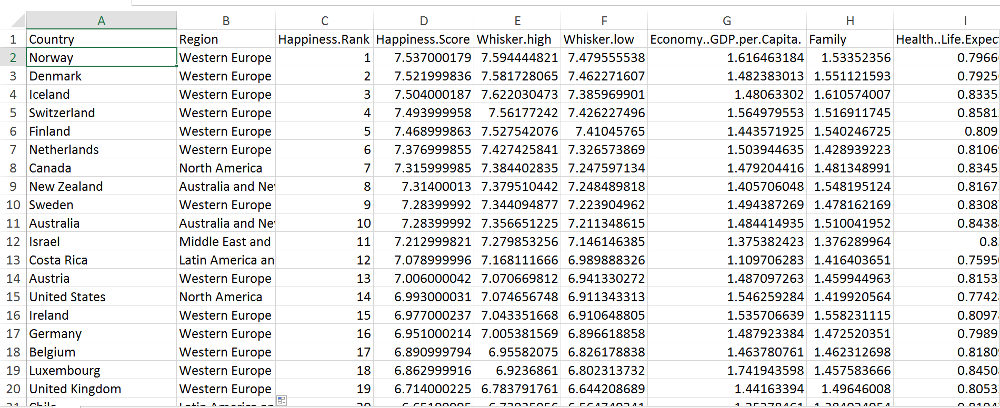

1.  Download 2017.csv, which you can find here:  <a href="https://raw.githubusercontent.com/bendazz/prac3/master/2017.csv">2017.csv</a>.

2.  Download 2016.csv, which you can find here:  <a href="https://raw.githubusercontent.com/bendazz/prac3/master/2016.csv">2016.csv</a>.

3.  Open 2017.csv.

4.  Import 2016.csv as an additional sheet in 2017.csv.

5.  Note that the 2017 data does not have a "Region" column.  Make space for one.

6.  Use vlookup to read the correct "Region" values from the 2016 data into the 2017 data.  Use the match function in the vlookup.

7.  Save your revised 2017.csv file using your last name.  For instance, if my name is Smith, I would rename 2017.csv as smith.csv.

8.  Use the following link to upload your file:  <a href="https://www.dropbox.com/request/2eux73R9kDyua03vD37J">upload link</a>.

###Solution###

Here is a screen shot of what the revised 2017 data should look like:

